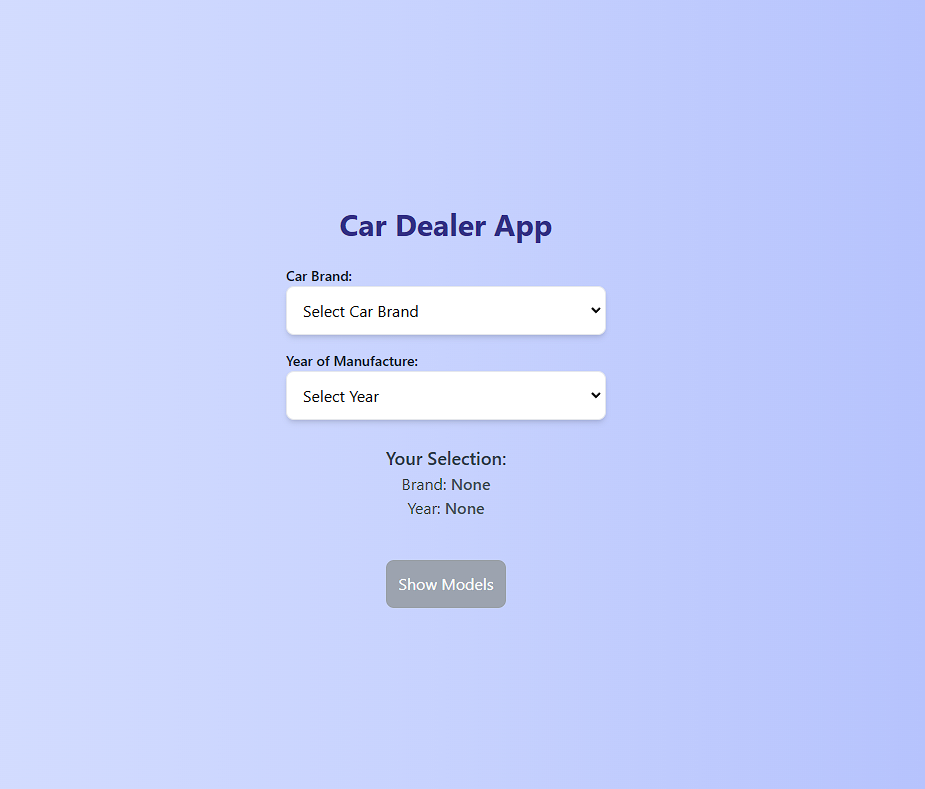

# Car Dealer App

This is a web application that allows users to browse car brands, select the year of manufacture, and view available models for their selected options.

## Features

- Fetches car brands and models from the National Highway Traffic Safety Administration API.
- Allows users to select a car brand and model year.
- Displays available models for the selected brand and year.

## Installation

### Clone the repository:

```bash
git clone https://github.com/kapolizei/CarDealerPet
cd CarDealerPet
```
### Install the dependencies:

```bash
npm install
```

### Run the project:

```bash
npm run dev
```

### Lint

```bash
npm run lint
```

### Format the code

```bash
npm run format
```
